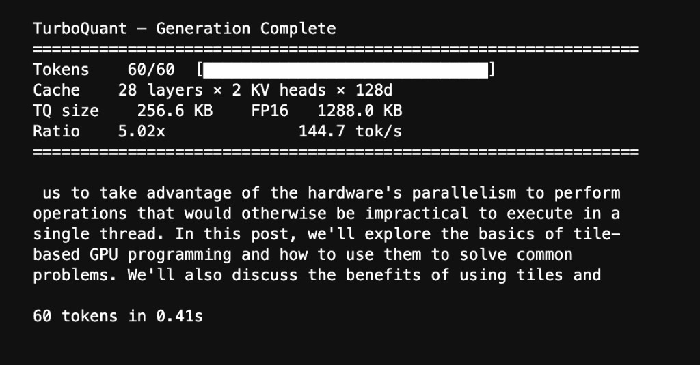
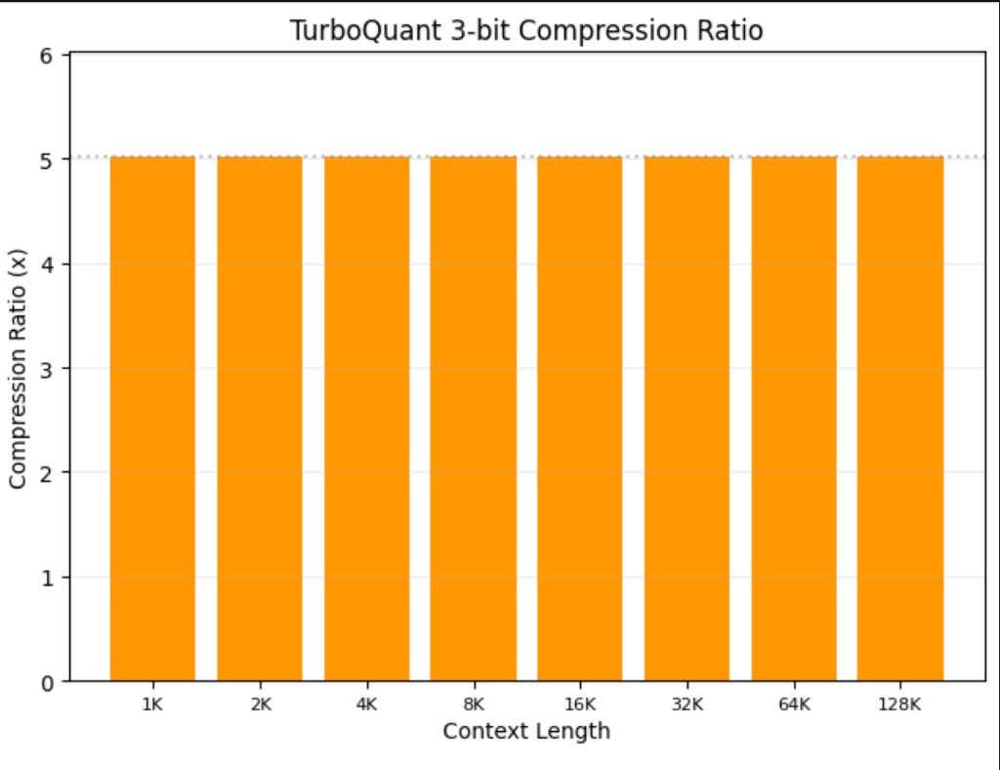
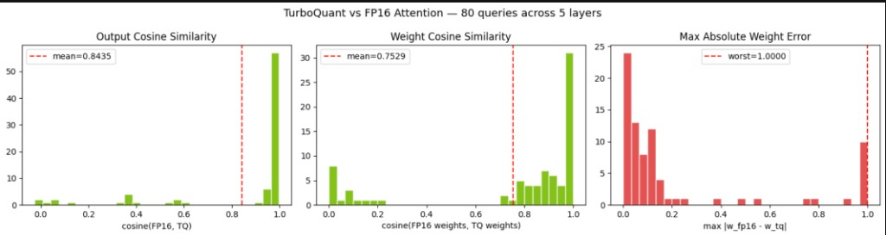
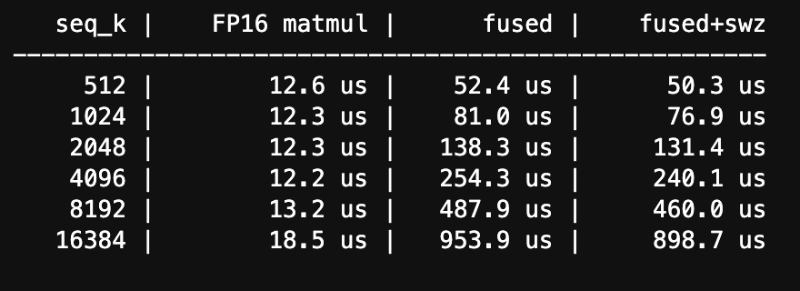
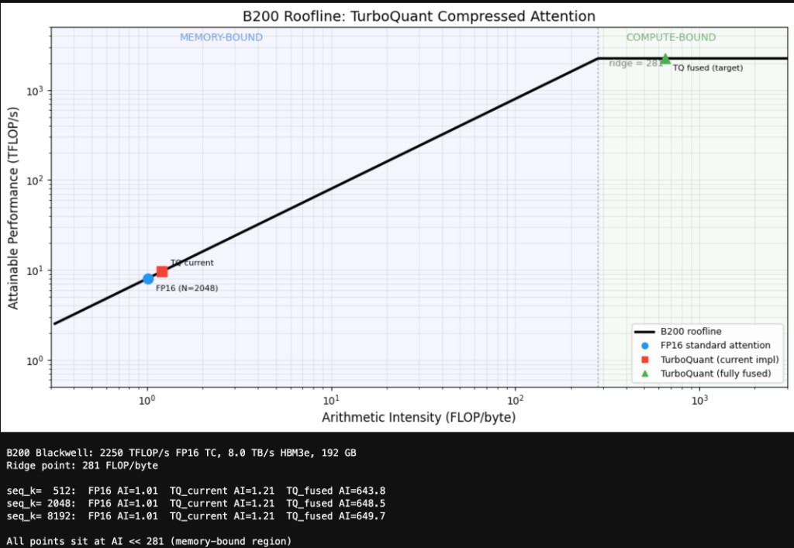

# TurboQuant cuTile

KV cache compression engine for LLM inference, built with NVIDIA cuTile on Blackwell.

Implements [TurboQuant](https://arxiv.org/abs/2504.19874) (ICLR 2026) as a set of custom GPU kernels:
random rotation, Lloyd-Max scalar quantization, and QJL bias correction. 3 bits per coordinate,
5x compression, attention scores stay unbiased.

Tested end-to-end on Qwen 2.5-1.5B running on a B200.

**[Blog / Write-up →]()**
**[Video Walkthrough →](https://youtu.be/HBXEUXgcrfM)**



## Results

| Metric | Value |
|--------|-------|
| Compression ratio | 5.02x |
| Bits per coordinate | 3 (keys: 2-bit MSE + 1-bit QJL, values: 3-bit MSE) |
| Output cosine similarity (layers 7-27) | ~0.985 |
| Generation speed | 144.7 tok/s on B200 |





## Kernels

Five kernel types, each with 2-bit and 3-bit variants:

| Kernel | What it does |
|--------|-------------|
| Key compression | Rotate → Lloyd-Max quantize → store QJL signs |
| Value compression | Rotate → Lloyd-Max quantize (8 centroids) |
| Value decompression | Centroid lookup → un-rotate via Π^T |
| Attention scoring | MSE dot product + QJL correction |
| Fused attention | Score + softmax + V accumulation, single kernel, no HBM round-trips |

The fused attention kernel decompresses values on-chip inside the KV block loop.
Π stays resident in shared memory. No intermediate writes to global memory.

Blackwell-specific: block swizzling, pipelined TMA loads, exp2 with flush-to-zero,
approximate division, occupancy=2 tuning.

## Repo structure

```
turboquant_cutile/
├── host.py           # TurboQuantEngine — precomputed state + kernel dispatch
├── compress.py       # Key/value compression kernels
├── decompress.py     # Value decompression kernels
├── attention.py      # Attention scoring + fused attention kernels
├── codebook.py       # Lloyd-Max codebook computation
├── constants.py      # Block sizes, head dim
└── __init__.py

tests/                # pytest suite
├── test_compress.py
├── test_decompress.py
├── test_attention.py
├── test_codebook.py
└── test_end_to_end.py

turboquant_b200_patch1.ipynb   # Full demo notebook
screenshots/                    # Notebook output captures
```

## Setup

You need a Blackwell GPU (B200 or B300). Easiest options:

**[Brev.dev](https://brev.dev)** — spin up a B200 instance, SSH in, clone the repo.

**[Modal](https://modal.com)** — use `modal.gpu.B200()` in your function decorator, mount the repo.

Once you have a Blackwell machine:

```bash
git clone https://github.com/anirudhbv/turboquant-cutile.git
cd turboquant-cutile
pip install cuda-tile transformers torch
```

Then open `turboquant_b200_patch1.ipynb` and run it top to bottom.
The notebook handles model loading, KV cache extraction, compression,
quality analysis, latency benchmarks, memory scaling, and live generation.

To run tests:

```bash
pytest tests/ -v
```

## Latency



Fused kernel includes scoring, QJL correction, online softmax, and V accumulation in one pass.
Block swizzle shaves ~6% at 16K tokens.

## Roofline



Both FP16 attention and the current TurboQuant kernel sit in the memory-bound regime.
The fully-fused target (all reconstruction on-chip, only compressed bytes cross HBM)
pushes arithmetic intensity past 600 into compute-bound territory. That's the goal.

## Paper

TurboQuant: Online Vector Quantization with Near-optimal Distortion Rate.
Zandieh, Daliri, Hadian, Mirrokni. [arXiv:2504.19874](https://arxiv.org/abs/2504.19874). ICLR 2026.

## Acknowledgments

Thanks to Bryce Adelstein Lelbach and the cuTile team at NVIDIA for Blackwell GPU access.
